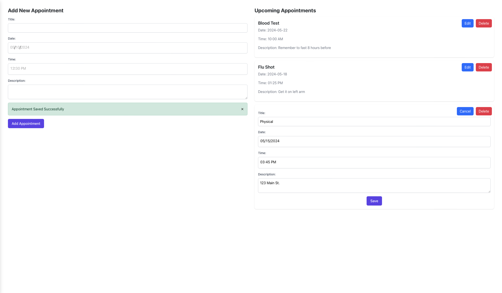

# CareFULL
Team W09: Fardin, Akhil, Issac, Kailer. Your personal health-care assistant in organizing your information, understanding trends, and being able to ask questions in a secure environment.

## Prerequistes
In order to successfully launch the application the following applications/dependencies are required. Reference/ Download the following resources when going through the Set Up:
* [Python3](https://www.python.org/) needed for virtual environment.
* [Django](https://docs.djangoproject.com/en/5.0/topics/install/) needed to run backend.
* [PostgreSQL](https://www.postgresql.org/download/) needed to host database.
* [Node.js](https://nodejs.org/en/download) needed to run frontend.
* [OpenAI API Key](https://platform.openai.com/docs/quickstart) needed for chatbot.
* Download The Chatbot Embeddings: [Embedding #1](https://drive.google.com/file/d/1ZDBhtrsZW4uykALnpQHnIHGCG7PLLOVl/view?usp=sharing), [Embedding #2](https://drive.google.com/file/d/1lpMraiTKsGWdexKZtTj4Y4SyaRIkgCdw/view?usp=sharing) used to give context to the chatbot. [Files were too large to push to GitHub]
* [Gmail App Generated Password](https://saurabh-nakoti.medium.com/how-to-set-up-smtp-in-gmail-using-an-app-password-96adffa164b3) needed to host server for email reminders. [Reference #2 in article: "Generate an App Password"]

## Set Up
To run our application, run the following commands in a Linux terminal: 
* `git clone https://github.com/FardinHaque60/CareFULL.git` to clone the repository in your current directory.
* `cd CareFULL/` to enter the repository.
* `python3 -m venv venv` to create a virtual environment.  
* `source venv/bin/activate` to activate the virtual environment.  
* `pip install -r requirements.txt` to install all the libraries needed to run the backend.
* `cd frontend && npm install` to install needed packages for frontend.
### Set Up the Database
* Open pgAdmin 4 that came with PostgreSQL and create a new user `CareFULL` with password `CareFULL`.
* Create a new database for this user named `CareFULL_DB`, make sure it has read/write privileges.
* Run `python manage.py makemigrations && python manage.py migrate` in the backend directory to connect to the database.
### Set Up the Chatbot
* Create a `.env` file in CareFULL root project directory
* Create a new variable `OPENAI_API_KEY=` and set it to your generated api key
* Place the downloaded embeddings files from above in the `backend/backend/scraped` directory
### Set Up Your Email Reminder Host
* In the `.env` file created above create two variables: 
    * `EMAIL_HOST_USER=` enter your gmail email address here.
    * `EMAIL_HOST_PASSWORD=` enter your app generated Gmail password here.
### Run the Application
* Open a new terminal and locate to the CareFULL directory and run `cd backend && python manage.py runserver` to run the backend.
* Open another terminal and locate to the CareFULL directory and run `cd frontend && npm run start` to run the frontend, this should open a new tab in your browser with the application. If not, type [localhost:3000](localhost:3000) in your browser.

## Application Views
### Login/Create Account
 

### Health Data
 

### Appointments
 

### Chatbot
